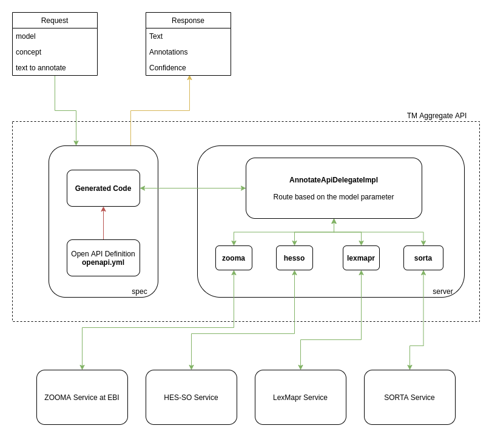

# CINECA WP3 Concept Annotator Consolidated API
Consolidated API for querying Work Package 3 Text Mining pipelines.

Make sure you have Java 11+ installed in your system
## Spring Boot
```shell
./mvnw clean install -e
cd server
../mvnw spring-boot:run
```
**

## Testing the API
Go to [http://localhost:8080/](http://localhost:8080/) to test the API. At the moment only `Zooma/EBI` `Model` is working. 


## Implementing services
The consolidated API is defined in `openapi.yml` file. We use a maven plugin to generate code stubs from the Open API definition. 
Generated code stubs are used in `server` module to implment services. In the `server`, 
`AnnotateApiDelegateImpl` implments the annotation API and it delegates annotation for each module depending on the `module` parameter in the request.
An example implementation can be found in `zooma` directory. 




### Files
```
+ server
| └─ src/main
|    └─ java/eu/cinecaproject
|    |  |  AnnotateApiDelegateImpl
|    |  |  ModelsApiDelegateImpl
|    |  |  ServerApplication
|    |  └─ zooma
|    |     .
|    └─ resources/static
|          cineca.html
+ spec
  └─ src/main/resources
        openapi.yml
```